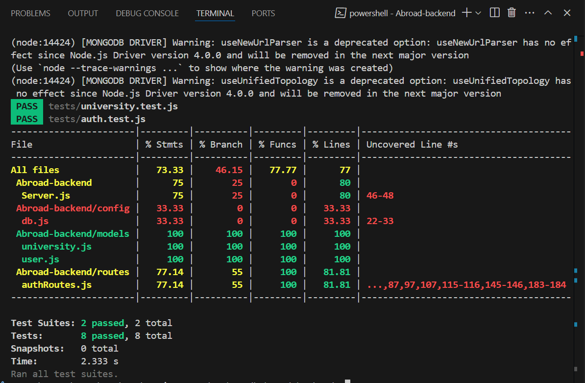

# Abroad Backend

This is the backend for the "Study Abroad" project, which provides APIs for user authentication, university data management, and user profile updates. The backend is built using Node.js, Express, and MongoDB.

## Features

- User registration and login with JWT-based authentication.
- CRUD operations for user profiles.
- Management of university data.
- Secure password hashing using bcrypt.
- Environment-based configuration using `.env` files.

## Technologies Used

- **Node.js**: JavaScript runtime for building the backend.
- **Express**: Web framework for building APIs.
- **MongoDB**: NoSQL database for storing user and university data.
- **Mongoose**: ODM for MongoDB.
- **JWT**: For secure user authentication.
- **bcryptjs**: For password hashing.
- **dotenv**: For environment variable management.
- **CORS**: For handling cross-origin requests.

## Installation

1. Clone the repository:
   ```bash
   git clone <repository-url>
   cd Abroad-backend
   ```

2. Install dependencies:
   ```bash
   npm install
   ```

3. Create a `.env` file in the root directory and add the following:
   ```properties
   MONGO_URI= "mongodb://0.0.0.0/Abroad"
   JWT_SECRET=MY_Key
   ```

4. Start the server:
   ```bash
   npm start
   ```

## API Endpoints

### Authentication Routes (`/api/auth`)

#### POST `/register`
- Registers a new user.
- **Request Body**:
  ```json
  {
    "name": "John Doe",
    "email": "john@example.com",
    "password": "password123"
  }
  ```
- **Response**:
  ```json
  {
    "token": "JWT_TOKEN",
    "user": {
      "id": "USER_ID",
      "name": "John Doe",
      "email": "john@example.com",
      "wishlist": {
        "country": "N/A",
        "fieldOfStudy": "N/A",
        "programType": "N/A"
      }
    }
  }
  ```

#### POST `/login`
- Logs in an existing user.
- **Request Body**:
  ```json
  {
    "email": "john@example.com",
    "password": "password123"
  }
  ```
- **Response**:
  ```json
  {
    "token": "JWT_TOKEN",
    "user": {
      "id": "USER_ID",
      "name": "John Doe",
      "email": "john@example.com"
    }
  }
  ```

#### GET `/get_user`
- Retrieves the authenticated user's data.
- **Headers**:
  ```json
  {
    "Authorization": "JWT_TOKEN"
  }
  ```

#### PUT `/update-profile`
- Updates the user's profile.
- **Request Body**:
  ```json
  {
    "name": "John Updated",
    "website": "https://example.com",
    "wishlist": {
      "country": "USA",
      "fieldOfStudy": "Engineering",
      "programType": "Masters"
    }
  }
  ```

### University Routes (`/api/auth`)

#### POST `/add-universities`
- Adds multiple universities to the database.
- **Request Body**:
  ```json
  [
    {
      "collegeName": "University A",
      "location": "City, Country",
      "coursesOffered": ["Course 1", "Course 2"],
      "scholarshipsOffered": ["Scholarship 1"],
      "eligibilityCriteriaForInternationalStudents": "Criteria details"
    }
  ]
  ```

#### GET `/universities`
- Retrieves all universities.
- **Response**:
  ```json
  {
    "universities": [
      {
        "collegeName": "University A",
        "location": "City, Country",
        "coursesOffered": ["Course 1", "Course 2"],
        "scholarshipsOffered": ["Scholarship 1"],
        "eligibilityCriteriaForInternationalStudents": "Criteria details"
      }
    ]
  }
  ```

## Project Structure

```
Abroad-backend/
├── config/
│   └── db.js               # MongoDB connection configuration
├── models/
│   ├── user.js             # User schema
│   └── university.js       # University schema
├── routes/
│   └── authRoutes.js       # Authentication and university routes
├── .env                    # Environment variables
├── package.json            # Project metadata and dependencies
├── Server.js               # Entry point of the application
└── Readme.md               # Project documentation
```

## Environment Variables

- `MONGO_URI`: MongoDB connection string.
- `JWT_SECRET`: Secret key for JWT token generation.

## Dependencies

- bcryptjs
- cors
- dotenv
- express
- jsonwebtoken
- mongoose

## Running the Project

1. Ensure MongoDB is running locally or provide a remote connection string in the `.env` file.
2. Start the server using:
   ```bash
   node Server.js
   ```
3. Access the APIs at `http://localhost:5000/api/auth`.

## Postman Testing

Postman can be used to test the APIs provided by this backend. Follow these steps:

1. **Install Postman**: Download and install Postman from [https://www.postman.com/downloads/](https://www.postman.com/downloads/).

2. **Set up the environment**:
   - Create a new environment in Postman.
   - Add the following variables:
     - `base_url`: `http://localhost:5000/api/auth`
     - `auth_token`: Leave this blank initially. Update it after logging in.

3. **Test Authentication APIs**:
   - Use the `/register` endpoint to create a new user.
   - Use the `/login` endpoint to log in and retrieve the `auth_token`.
   - Update the `auth_token` variable in your Postman environment.

4. **Test Protected Routes**:
   - For routes like `/get_user` and `/update-profile`, include the `Authorization` header with the value `Bearer {{auth_token}}`.

## Adding University Data Using Postman

If you have scraped university data in JSON format, you can add it to the MongoDB database using the `/add-universities` endpoint. Follow these steps:

1. **Prepare the JSON Data**:
   - Ensure the scraped data is in the following format:
     ```json
     [
       {
         "collegeName": "University A",
         "location": "City, Country",
         "coursesOffered": ["Course 1", "Course 2"],
         "scholarshipsOffered": ["Scholarship 1"],
         "eligibilityCriteriaForInternationalStudents": "Criteria details"
       },
       {
         "collegeName": "University B",
         "location": "City, Country",
         "coursesOffered": ["Course 3", "Course 4"],
         "scholarshipsOffered": ["Scholarship 2"],
         "eligibilityCriteriaForInternationalStudents": "Criteria details"
       }
     ]
     ```

2. **Send a POST Request**:
   - Open Postman and create a new request.
   - Set the method to `POST` and the URL to `{{base_url}}/add-universities`.
   - In the `Headers` tab, add:
     - `Content-Type`: `application/json`
     - `Authorization`: `Bearer {{auth_token}}`
   - In the `Body` tab, select `raw` and paste the JSON data.

3. **Submit the Request**:
   - Click `Send` to add the universities to the database.
   - If successful, you will receive a response confirming the addition of the universities.

---

## 📦 Tech Stack

- Express.js
- MongoDB
- React (Frontend not required for this session)
- Jest (Testing)
- Supertest

## 🧪 Testing Summary

- ✅ Unit & API tests written using Jest + Supertest
- ✅ Achieved **73%+** statement coverage
- ✅ Included integration testing with MongoDB

### 🖼️ Test Coverage Screenshot



---

## Frontend

The frontend documentation is available in the [Abroad Frontend README](../Abroad-frontend/README.md).


